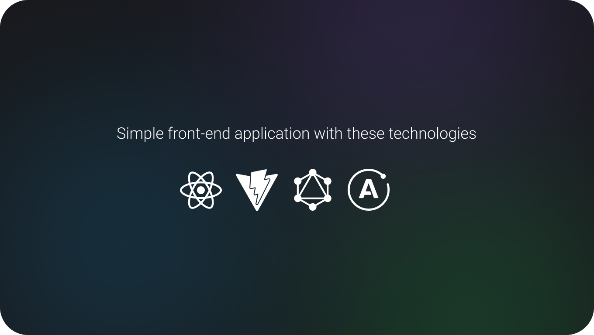

	

<h3 align="center">Study React.JS with Apollo client</h3>

This project is mainly for study purposes. Explored how react application can fetch data via graphql and apollo client.

---

 <a href="#about">About</a> •
 <a href="#started">Getting started</a> •
 <a href="#built_using">Technologies</a> •
 <a href="#authors">Authors</a>

---

## 🏁 Getting Started 

### 🎐 Prerequisites

1. Install `node >= 14`

### ✨ Installing

1. Clone this repository or install all the files
2. Run `pnpm i`
3. Change the `VITE_GRAPHQL_URL` in `.env` file to your graphql server url
4. Run locally with `pnpm dev`

### 🏁 Run

1. Visit `https://localhost:3000` to see the project running

## ⚙ Built with 

## ✍️ Authors 
- [@Hiyudev](https://github.com/Hiyudev)

## © License
- MIT License